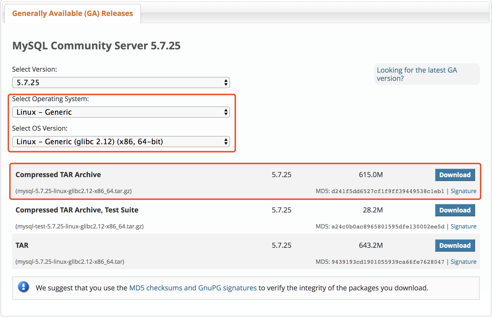

## 零、约定

tar包解压安装及配置相关路径定义如下：

下载目录：~/downloads/

安装目录：~/application/mysql5.7.25

数据目录：~/application/mysql5.7.25/userdata/data

日志目录：~/application/mysql5.7.25/userdata/log

配置文件：/etc/mysql/my.cnf

超级用户：root   root

管理用户：mmmy   qrlovely1314

## 一、安装

### Ubuntu 安装

```sh
$ sudo apt install mysql-server-5.7
```

### tar 包安装

- #### 下载与解压

  地址: https://dev.mysql.com/downloads/mysql/5.7.html#downloads

  选择Linux - Generic版本，并选取对应的操作系统位数，下载tar.gz包

  

  获取下载地址后执行如下命令

  ```sh
  $ cd ~/downloads
  $ wget https://cdn.mysql.com//Downloads/MySQL-5.7/mysql-5.7.25-linux-glibc2.12-x86_64.tar.gz
  $ tar zxvf mysql-*.tar.gz -C ~/applications
  $ cd ~/application
  $ mv mysql* mysql5.7.25
  ```

- #### 创建数据目录

  ```sh
  $ cd ~/application/mysql5.7.25
  $ mkdir data
  ```

- #### 安装

  ```sh
  $ cd ~/application/mysql5.7.25/bin
  $ ./mysqld --initialize --user=root --basedir=/home/mmmy/application/mysql5.7.25 --datadir=/home/mmmy/application/mysql5.7.25/data
  
  2019-02-18T16:36:25.274530Z 0 [Warning] TIMESTAMP with implicit DEFAULT value is deprecated. Please use --explicit_defaults_for_timestamp server option (see documentation for more details).
  2019-02-18T16:36:25.278567Z 0 [Warning] One can only use the --user switch if running as root
  2019-02-18T16:36:27.543199Z 0 [Warning] InnoDB: New log files created, LSN=45790
  2019-02-18T16:36:28.038496Z 0 [Warning] InnoDB: Creating foreign key constraint system tables.
  2019-02-18T16:36:28.245168Z 0 [Warning] No existing UUID has been found, so we assume that this is the first time that this server has been started. Generating a new UUID: 56e73636-339b-11e9-9552-705ab664cd3d.
  2019-02-18T16:36:28.293380Z 0 [Warning] Gtid table is not ready to be used. Table 'mysql.gtid_executed' cannot be opened.
  2019-02-18T16:36:28.294376Z 1 [Note] A temporary password is generated for root@localhost: Stg+j#-Eh0+?
  ```

  请记住最后的临时密码**Stg+j#-Eh0+?**，用于改密之用。
## 二、配置

- ####配置文件

  msyql配置文件有多处地方，依次读取顺序为 **/etc/my.cnf** -->  **/etc/mysql/my.cnf** -->  **/usr/etc/my.cnf** -->  **~/.my.cnf**

  每个文件格式都相同，配置项相同情况下，按照最后一个读取到的值为准。

  创建配置文件

  ```sh
  $ cd /etc/mysql
  $ sudo touch my.cnf
  ```

  编辑配置文件内容如下

  ```
  [client]
  # 客户端连接端口号 默认3306
  port = 3306
  
  # 设置socket文件所在目录
  socket  = /home/mmmy/application/mysql5.7.25/tmp/mysql.sock
  
  [mysqld]
  ###############################基础设置#####################################
  
  # mysql服务的唯一编号 每个mysql服务Id需唯一
  server-id = 1 
  
  # 服务端口号 默认3306
  port = 3306
  
  # mysql安装根目录
  basedir = /home/mmmy/application/mysql5.7.25
  
  # mysql数据文件所在位置
  datadir = /home/mmmy/application/mysql5.7.25/data
  
  # 临时目录 比如load data infile会用到
  tmpdir  = /home/mmmy/application/mysql5.7.25/tmp
  
  # 设置socket文件所在目录
  socket  = /home/mmmy/application/mysql5.7.25/tmp/mysql.sock
  
  ###############################基础设置end##################################
  ```

  以上是最基本配置，由于配置繁多，其他配置将另外写文章单独讲解

- #### 添加可执行路径

  编辑/etc/bash.bashrc  末尾添加如下内容

  ```
  # added by MySQL install
  export MYSQL_HOME="/home/mmmy/application/mysql5.7.25"
  export PATH="$PATH:/home/mmmy/application/mysql5.7.25/bin"
  ```

  

