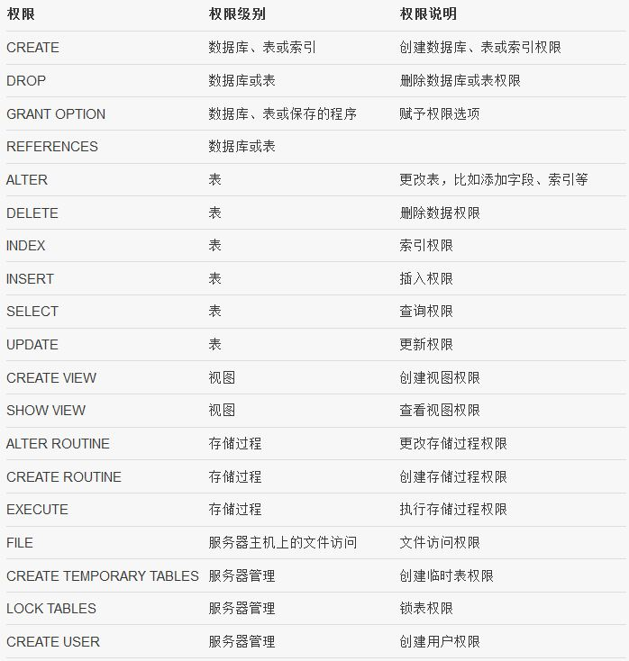
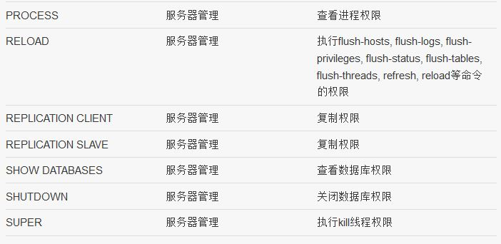

### 一.创建用户: 

**命令:**

```mysql
CREATE USER 'username'@'host' IDENTIFIED BY 'password'; 
```

**说明:**

- username - 你将创建的用户名
- host - 指定该用户在哪个主机上可以登陆,如果是本地用户可用localhost, 如果想让该用户可以从任意远程主机登陆,可以使用通配符%
- password - 该用户的登陆密码,密码可以为空,如果为空则该用户可以不需要密码登陆服务器

**例子:**

```mysql
CREATE USER 'dog'@'localhost' IDENTIFIED BY '123456'; 
CREATE USER 'pig'@'192.168.1.101_' IDENDIFIED BY '123456'; 
CREATE USER 'pig'@'%' IDENTIFIED BY '123456'; 
CREATE USER 'pig'@'%' IDENTIFIED BY ''; 
CREATE USER 'pig'@'%'; 
```


### 二.授权: 

**命令:**

```mysql
GRANT privileges ON databasename.tablename TO 'username'@'host' 
```

**说明:** 

- privileges - 用户的操作权限,如SELECT , INSERT , UPDATE 等(详细列表见该文最后面).如果要授予所的权限则使用ALL
- databasename - 数据库名
- tablename-表名,如果要授予该用户对所有数据库和表的相应操作权限则可用*表示, 如*.*.

**例子:**

```mysql
GRANT SELECT, INSERT ON test.user TO 'pig'@'%'; 
GRANT ALL ON *.* TO 'pig'@'%';
```

注意: 用以上命令授权的用户不能给其它用户授权,如果想让该用户可以授权,用以下命令: 

```mysql
GRANT privileges ON databasename.tablename TO 'username'@'host' WITH GRANT OPTION; 
```


###三.设置与更改用户密码 

**命令:**

```mysql
SET PASSWORD FOR 'username'@'host' = PASSWORD('newpassword');
```

如果是当前登陆用户用

```mysql
SET PASSWORD = PASSWORD("newpassword"); 
```

**例子:** 

```mysql
SET PASSWORD FOR 'pig'@'%' = PASSWORD("123456"); 
```


###四.撤销用户权限 

**命令:** 

```mysql
REVOKE privilege ON databasename.tablename FROM 'username'@'host'; 
```

**说明:** 

privilege, databasename, tablename - 同授权部分. 

**例子:**

```mysql
REVOKE SELECT ON *.* FROM 'pig'@'%'; 
```

注意: 假如你在给用户'pig'@'%'授权的时候是这样的(或类似的):GRANT SELECT ON test.user TO 'pig'@'%', 则在使用REVOKE SELECT ON *.* FROM 'pig'@'%';命令并不能撤销该用户对test数据库中user表的SELECT 操作.相反,如果授权使用的是GRANT SELECT ON *.* TO 'pig'@'%';则REVOKE SELECT ON test.user FROM 'pig'@'%';命令也不能撤销该用户对test数据库中user表的Select 权限. 

具体信息可以用命令SHOW GRANTS FOR 'pig'@'%'; 查看. 


###五.删除用户 

**命令:** 

```mysql
DROP USER 'username'@'host'; 
```


###六.附注 - 在MySQL中的权限对应的操作

*权限：操作*

ALTER: Allows use of ALTER TABLE.

ALTER ROUTINE: Alters or drops stored routines.

CREATE: Allows use of CREATE TABLE.

CREATE ROUTINE: Creates stored routines.

CREATE TEMPORARY TABLE: Allows use of CREATE TEMPORARY TABLE.

CREATE USER: Allows use of CREATE USER, DROP USER, RENAME USER, and REVOKE ALL PRIVILEGES.

CREATE VIEW: Allows use of CREATE VIEW.

DELETE: Allows use of DELETE.

DROP: Allows use of DROP TABLE.

EXECUTE: Allows the user to run stored routines.

FILE: Allows use of SELECT... INTO OUTFILE and LOAD DATA INFILE.

INDEX: Allows use of CREATE INDEX and DROP INDEX.

INSERT: Allows use of INSERT.

LOCK TABLES: Allows use of LOCK TABLES on tables for which the user also has SELECT privileges.

PROCESS: Allows use of SHOW FULL PROCESSLIST.

RELOAD: Allows use of FLUSH.

REPLICATION: Allows the user to ask where slave or master.

CLIENT: servers are.

REPLICATION SLAVE: Needed for replication slaves.

SELECT: Allows use of SELECT.

SHOW DATABASES: Allows use of SHOW DATABASES.

SHOW VIEW: Allows use of SHOW CREATE VIEW.

SHUTDOWN: Allows use of mysqladmin shutdown.

SUPER: Allows use of CHANGE MASTER, KILL, PURGE MASTER LOGS, and SET GLOBAL SQL statements. Allows mysqladmin debug command. Allows one extra connection to be made if maximum connections are reached.

UPDATE: Allows use of UPDATE.

USAGE: Allows connection without any specific privileges.


###七.附注 - 权限中文说明





